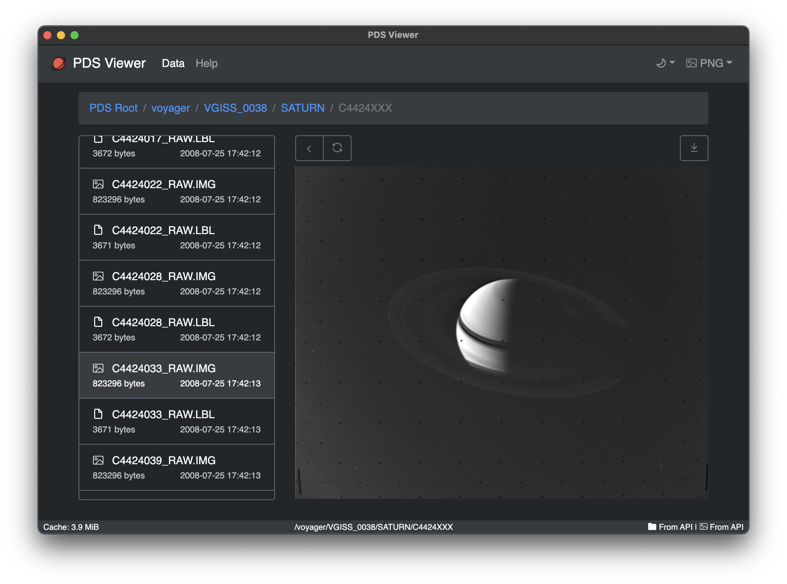

# PDS Viewer

This is a frontend for the Planetary Data System of NASA JPL.

# Usage

## Desktop App

1. Clone the repo
2. `yarn install`
3. `yarn build`
4. Open the file in the `/out`

## Frontend Only

1. Clone the repo
2. `yarn install`
3. `yarn react:build`
4. The files will be in `/dist`

# Disclaimer

This tool and its authors are not affiliated or endorsed by NASA. 
